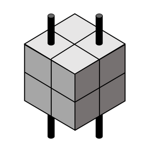

# <a name="_b7arsru8tzwf"></a>KnowledgeTensors and the Alienocracy



Enmai M'Cimbu
## <a name="_onaftp268rqm"></a>Abstract  
Humanity faces an unprecedented crisis of misinformation, distrust, and inefficiency in addressing critical global challenges such as climate change. Misinformation can be broadly categorized into two types: (A) *Informative Misinformation*—such as the claim that the Earth is flat—which, while inaccurate, tends to have limited societal consequences; and (B) *Evaluative Misinformation*—for example, the assertion that climate change is not a serious concern—which has the potential to cause significant harm by undermining public understanding and policy responses. The fundamental issue lies in the fact that misinformation is **structurally indistinguishable** from the truth. It is disseminated through the same mediums—tweets, videos, articles, and academic papers—making it challenging to differentiate between fact and falsehood. 

**KnowledgeTensors** are spreadsheets that scale from 2 dimensions up to a varying number of dimensions and are designed to express metric based Evaluation Knowledge.  While they do not possess the full expressive capacity of natural human languages, they are sufficiently expressive to represent complex domains such as climate science, public health, and policy evaluation. Although KnowledgeTensors may appear more complex, this complexity is levied against domain experts and in return **knowledge consumers can process vast amounts of high-quality evaluative knowledge with zero cognitive effort.** KnowledgeTensors can be merged into a Supermind called the **UniversalKnowledgeTensor** **that is inherently resistant to misinformation**. The integrity and resilience of the UniversalKnowledgeTensor are maintained through a blockchain infrastructure, ensuring transparency, censorship resistance, and survivability of the platform. There are many benefits to an incorruptible supermind, but the main benefit is transitioning governments to a distributed decision-making framework called an **Alienocracy**.
## <a name="_t33pfytqvxz7"></a>1. Introduction
KnowledgeTensors introduce a transformative framework for knowledge distribution, aggregation, and the generation of actionable insights, addressing critical gaps in climate change communication and other pressing global challenges. By leveraging blockchain technology, decentralized knowledge distribution, and an innovative scoring system, this paradigm aims to enhance transparency, trust, and decision-making. This paper explores the detailed design of KnowledgeTensors and the supporting blockchain ( currently named TruthCoin), the issues of traditional methods, and the implications of adopting this system in addressing misinformation, fostering trust, and optimizing resource allocation. 

Climate change communication, in particular, suffers from failures in metric selection, relevance, and trust. For decades, scientists have struggled to convey the gravity of climate change in ways that resonate with diverse audiences, often hindered by technical language, perceived biases, and the overwhelming scale of the problem. KnowledgeTensors seeks to bridge these gaps through a comprehensive, transparent, and incorruptible platform, enabling the aggregation of expert knowledge and its transformation into actionable metrics.

The fundamental purpose of **knowledge** is to enable individuals to develop **accurate mental models of the world**, allowing them to make informed **decisions (i.e., actions)** that enhance their well-being. Every assertion in this paper should be evaluated against this criterion. KnowledgeTensors seeks to optimize knowledge processing in alignment with this objective.

To summarize in a non-technical manner, the incorruptible supermind known as **UniversalKnowledgeTensor** functions as the **definitive oracle of human knowledge**, synthesizing validated insights from diverse fields into a unified framework. Within this system, the **LifeScore** serves as the **oracle’s individualized assessment**, offering a comprehensive evaluation of a person’s well-being, risks, and opportunities.

The following questions are answered in this paper:

- What is a KnowledgeTensor and the **UniversalKnowledgeTensor**? Section "2 KnowledgeTensor"
- How is the UniversalKnowledgeTensor the most **Usable, Actionable and Individualized** form of Knowledge? Section "3 LifeScore"
- What is an **Alienocracy** and why is it the most optimal form of government? Section "4 Alienocracy"
- How is the UniversalKnowledgeTensor the form of knowledge with the highest amount of **integrity** and as a result incorruptible?  To address this question, we demonstrate that this platform still maintains integrity even in the worst case scenario where there exists a well-funded and well-resourced **intelligence agency** whose sole mission is to **corrupt** the UniversalKnowledgeTensor. This section is quite technical and is answered in "Appendix C: Blockchain and Integrity". 
- How to **implement** these technologies? This section is also technical and is answered in "Appendix D Technical Details" as well as the proof-of-concept demo at https://github.com/Enmai-MCimbu/KnowledgeTensor
- What are some other benefits of the UniversalKnowledgeTensor and the LifeScore?
  - **Censorship Immunity**: Section "Appendix C.5 Alternate Security Benefits"
  - **Platform Survivability**: Section "Appendix C.5 Alternate Security Benefits"
  - **Enshittification Immunity**: Section "Appendix C.5.1 SEPAM"
  - **User Privacy**: Section "Appendix C.5 Alternate Security Benefits"
  - **Misinformation due to the nature of Human Languages**: Section "Appendix B.1 Traditional Knowledge Dissemination and Processing"
  - **Climate Change Communication**s: Section "Appendix B.2 Climate Science Communication Issues"
## <a name="_5n6j1odj8xix"></a>2. KnowledgeTensors
**KnowledgeTensors are spreadsheets** that have been scaled from 2 dimensions to a **varying number of dimensions**. Each cell in a KnowledgeTensor is called a **KnowledgeCell** and it encodes **specific claims made by the expert,** thereby enabling detailed and structured knowledge representation. While they lack the full expressivity of natural human languages, they are expressive enough to address key global challenges such as climate change, public health, and policy evaluation.

Consider the metric evaluating the probability of experiencing a heart attack within a given year. This metric is primarily dependent on **age**, allowing for the creation of a mathematical formula that predicts heart attack risk as a function of age. However, **location** and **ethnicity** also influence heart attack risk, yet these variables cannot be seamlessly incorporated into a single mathematical formula. To accommodate this complexity, a **two-dimensional table** can be constructed, where rows represent different locations, columns represent different ethnicities, and each cell contains a formula that estimates heart attack risk based on age.  

While a two-dimensional table accounts for location and ethnicity, **gender** also plays a critical role in determining heart attack rates. Since a two-dimensional structure cannot fully capture this additional complexity, a **third dimension**—gender—is introduced, effectively transforming the table into a **tensor**.  

This multidimensional representation of knowledge is termed a **KnowledgeTensor**. Each discrete cell within this tensor is referred to as a **KnowledgeCell**, containing a formula that calculates heart attack probability based on the dimensions being considered. A person using this KnowledgeTensor is interested in only one of these cells that is most relevant to them. This feature is named **Simple Mutually Exclusivity(SME)** and it is a key feature that allows the organization of knowledge. This is discussed further in "Appendix E.3 Structured Knowledge ".

The utility of KnowledgeTensors extends beyond heart attack risk assessment. Rather than constructing **separate tensors** for different medical conditions (e.g., cancer, diabetes), an **additional dimension** can be incorporated to represent all diseases into the existing tensor. Similarly, other dimensions can be introduced, such as **Metrics Dimension** to encompass different aspects of heart disease such as rate, treatment costs, and mortality risk.  **Object Type Dimension** to differentiate knowledge applicability between humans, animals, governments, corporations, ecosystems , planets, etc... An **Action Dimension** to capture the effect of no intervention or various interventions (e.g., no medical action vs. medication vs. surgical procedures).  A more formal discussion of Core Dimensions, Filterable Dimensions and other Dimensions can be found in the "Appendix D.5 Dimensions of Knowledge".

**Uncertainty** inherently limits an expert's ability to determine the exact value of a given metric. However, the absence of precise knowledge **does not equate to a complete lack of knowledge**. Rather than relying on fixed values, KnowledgeCells accommodate **probabilistic distributions** as their claims, allowing experts to specify a **range of possible outcomes**.  For example, an expert may be unable to predict with certainty an individual’s probability of experiencing a heart attack within a specific demographic. However, given a **sufficiently large dataset**, the expert can encode this information as a **continuous probability distribution**, representing the likelihood of different outcomes.  

The process of **aggregating distributions** within the UniversalKnowledgeTensor is further examined in “Appendix D.3: Result Aggregation”, while the concept of **State Distributions**, which extends probabilistic modeling across multiple states, is discussed in ”Appendix E.3.2: State Distributions”. By integrating probabilistic reasoning, KnowledgeTensors enhance the robustness of knowledge representation, ensuring that uncertainty is quantified rather than ignored.

**Merging of Knowledge** In a decentralized knowledge system, multiple experts contribute to the construction of KnowledgeTensors. Each expert encodes their domain-specific knowledge into a **separate KnowledgeTensor**, leading to variations in knowledge representation. As a result, experts may generate KnowledgeCells that **Align completely** ,  **Slightly differ** or  **Significantly diverge** with those of other experts.  

To resolve inconsistencies across expert contributions and to account for consensus opinions, mechanisms must be established to synthesize individual KnowledgeTensors into a **UniversalKnowledgeTensor**. The UniversalKnowledgeTensor would simplify the knowledge retrieval process, allowing the user to query the UniversalKnowledgeTensor without having to query a subset of experts. A straightforward approach would involve computing a **weighted average** of these Individual KnowledgeTensor contributions; however, the critical challenge lies in determining the appropriate weighting for each KnowledgeTensor.  

The solution to this challenge is **TruthCoins**. Within the UniversalKnowledgeTensor framework, each KnowledgeTensor is weighted in direct proportion to the **number of TruthCoins it possesses**. This system allows for the quantification of knowledge reliability and value, ensuring that KnowledgeTensors with **greater epistemic credibilit**y( through TruthCoin purchases) exert a stronger influence on the aggregated UniversalKnowledgeTensor.  

To maintain a transparent and immutable record of TruthCoin allocations, a **blockchain-based ledger** is employed. Unlike traditional financial instruments, TruthCoins do not represent monetary assets. However, the **currency paradigm** is leveraged as a conceptual framework since in economic systems, a higher price implies greater value (e.g., Product A is deemed more valuable than Product B if it is priced higher). Similarly, in the UniversalKnowledgeTensor, a KnowledgeTensor associated with a larger TruthCoin allocation is intuitively perceived as having a **higher epistemic value** than one with fewer TruthCoins.  

TruthCoins are not distributed arbitrarily and instead are awarded to individuals with **exceptional intellectual merit** as categorized by external organizations. The implementation of TruthCoins and blockchain technology provides a robust, decentralized method for aggregating and weighting expert knowledge, ensuring that **the UniversalKnowledgeTensor reflects the most authoritative, rigorously validated, and consensus-driven knowledge possible**. These mechanisms will be further elaborated in the "Appendix C: Blockchain and Integrity".

**Example:** A KnowledgeTensor consists of multiple KnowledgeCells, which serve as the fundamental units of knowledge representation within the system. Each KnowledgeCell encapsulates expert knowledge through two primary components:  

1\. **Cell Location in the UniversalKnowledgeTensor Space (CellLoc):** Defines the specific dimensions within the UniversalKnowledgeTensor to which the claim applies. The ‘Cell Location’ is composed of many specific values each in a single dimension which are called ‘Partial Locations’. A proposed encoding is to separate ‘Partial Locations’ with a semicolon ';' and to separate Hierarchical levels within a ‘Partial Locations’ with a forward slash '/'

2\. **Claim**: A concise set of statements encoded using TruthScript, a language similar to Python that can intuitively and securely represent expert knowledge in a computationally interpretable manner. Since TruthScript will be executed on many distributed machines and malicious KnowledgeTensors are inevitable, strict security protocols are enforced to ensure **absolute isolation** from external resources. All function calls to the filesystem, internet, and the operating system are explicitly **forbidden**, eliminating the possibility of unauthorized access or security breaches.  No extension of TruthScript should ever be allowed to pose even a remote security vulnerability. 

```
# Sample KnowledgeCell

object/person;metric/rate_per_year;of/health/disease/heart_attack;action/;ktp_type/dir_est;start_time/2014.00;end_time/+2034.00;address/country1/state2/city3;gender/g1;ethnicity/e1
    age = get_age(time_index)
    return 0.002*(age/10)^2
```

This Cell Location encoding conveys the following information:  

\- **Metric**: The annual rate of heart attacks for people.  
\- **Demographic Scope:** The claim applies to individuals in "Country1, State2, City3" of "Gender g1" and "Ethnicity e1".  
\- **Temporal Validity**: The estimate is applicable between "2014 and 2034".  
\- **Nature of Knowledge**: A direct estimate ("ktp\_type/dir\_est") rather than a direct measurement or an aggregation of other KnowledgeCells.  
\- **Action Context:** The claim describes the "baseline reality" (i.e., no external interventions such as diet, exercise, medication, or surgery are assumed).  

The claim attempts to formulate the above metric as a function of age. The 'time\_index' keyword is a reserved symbol in TruthScript to denote the time increment in the simulation. The function 'get\_age(time\_index)' returns the age of the object at that epoch during the simulation and the function 'get\_time(time\_index)' returns the actual time at that epoch. 

By structuring knowledge in this manner, KnowledgeTensors provide a robust, high-dimensional representation of expert knowledge, facilitating precise, contextualized, and actionable evaluations within the UniversalKnowledgeTensor framework.
## <a name="_a5vll8yd6rc5"></a>3. LifeScore
The LifeScore metric is central to the UniversalKnowledgeTensor's ability to evaluate all topics and actions. Although not a formally recognized SI unit, monetary value (e.g., dollars) serves as a universally understood proxy. The LifeScore automatically aggregates all positive and negative influences on an individual's quality of life, integrating financial and non-monetary factors into the score.

Starting with user defined parameters (such as profession, location, gender, ethnicity, genetics, etc), the LifeScore aggregates the Applicable KnowledgeCells across all possible topics and actions. For instance, an underwater basket weaver in EnmaiLand would have a LifeScore that incorporates the most relevant and up-to-date data on income, occupational hazards (e.g., shark attacks), rent, car accidents, heart attacks and other relevant aspects of their life.

**Applications of LifeScore:**

1\. **Climate Awareness** LifeScore highlights the direct and indirect effects of climate change on individual lives, making abstract environmental concepts tangible. For example, it can measure the increased risk of health issues due to rising temperatures or air pollution.

2\. **Health Optimization**: By aggregating health-related data, LifeScore provides insights into the probable outcomes of lifestyle changes and other actions, such as improved diet or increased physical activity.

3\. **Economic Decision-Making:** LifeScore can guide financial choices by evaluating the long-term benefits and risks associated with investments or policy changes, offering a clear perspective on sustainability and profitability.

4\. **Policy Evaluation:** Governments and institutions can use aggregated LifeScores to assess the effectiveness of public policies and allocate resources more effectively.

**Metric Expansion**  Beyond monetary factors, LifeScore incorporates additional dimensions, such as time and risk, through metric converters. For example, 'money\_per\_hour' translates time into a monetary equivalent, enabling comparisons between options that differ in time and cost. Similarly, 'money\_per\_death' integrates risk into decision-making. These converters allow individuals to tailor their LifeScore calculations based on personal preferences and values.

Some metrics, such as 'money\_per\_death,' may seem controversial, yet society routinely assigns implicit values to life. For instance, decisions to permit higher speed limits reflect an acceptance of trade-offs between safety and economic costs. By allowing users to define their own metric converters, LifeScore ensures a personalized assessment of their life.

**Events** can be integrated into the **LifeScore framework** by incorporating their occurrence rates alongside other key metrics. For multi-metric events—such as contracting COVID-19—a quantitative approach to measuring **event relevance** can be expressed using the following formula:  

```
relevance = rate_per_year*(money_per_event + time_per_event*money_per_hour + death_per_event * money_per_death)
```

This formula accounts for various impacts of an event, including **direct financial costs** (money\_per\_event), **time-related opportunity costs** (time\_per\_event × money\_per\_hour), and **mortality risks** (death\_per\_event × money\_per\_death).  

The formula above represents a **proposed method** for integrating event-based impacts into LifeScore calculations. However, subject-matter experts may advocate for alternative formulations depending on the **specific event type and context**. The **KnowledgeTensor framework** is designed to accommodate **multiple methods of metric expansion**, allowing for flexible adaptation to different analytical approaches.  

**User Customization** To enhance LifeScore accuracy the metric converters, such as money\_per\_hour and money\_per\_death, should be **customizable by the user**. This ensures that LifeScore calculations reflect **personalized economic and risk assessments**, leading to more meaningful and individualized results.  

**Limitations** While the proposed LifeScore model is effective for most individuals, certain edge cases require additional consideration. For example, consider a homeless individual who lacks a formal income and relies on charitable food donations. Under the proposed formula, their LifeScore might be calculated as zero, failing to reflect critical life circumstances.  

To accurately capture well-being changes for individuals receiving non-monetary support, subsidies and assistance benefits must be incorporated into the LifeScore model. A reduction in available charitable resources or government aid would thereby be quantified as a decline in LifeScore, ensuring a more holistic representation of life quality.  Further refinements and technical discussions can be found in "Appendix D.2 LifeScore Structure" .

**Benefits** The LifeScore metric leverages the UniversalKnowledgeTensor to deliver a highly individualized and actionable metric, ensuring optimal usability, transparency, and efficiency in knowledge processing. The following key benefits are achieved for the platform:  

1\. **Knowledge Usability**  LifeScore traverses all **important KnowledgeCells** within the UniversalKnowledgeTensor. This process ensures the highest possible level of Knowledge Usability, as all relevant data points are considered in the assessment.  

2\. **Attention Span Zeroization**  Users are not required to actively engage with or process large amounts of information. Since all relevant knowledge is incorporated directly into the LifeScore, users can **safely ignore** individual data points without loss of accuracy.  

3\. **Knowledge Individualization**  Queries to the UniversalKnowledgeTensor return only **the most personally relevant and up-to-date** KnowledgeCells.  The filterable dimensions ensure that the LifeScore reflects **highly individualized assessments** tailored to the user’s specific attributes and circumstances. Additional technical details on filterable dimensions can be found in "Appendix B.6.3 Filterable Dimension Priority"  and "Appendix B.7.1 UserFilter"

4\. **Knowledge Actionability** The LifeScore is first computed based on the user’s **current realit**y, assuming no actions are taken. It is then recomputed for **every possible action** the user could take, illustrating how each action impacts their LifeScore. This allows users to **quantify the effect of their choices**, providing a data-driven decision-making tool that covers every possible action. Further discussion on Knowledge Actionability is available in the “Appendix C.7.5  ActionPropagation”.  

5\. **Transparency**  The computation of LifeScore is fully traceable within the UniversalKnowledgeTensor. Users can **examine the specific data points and formulas** influencing their LifeScore, fostering trust and engagement with the system.  
## <a name="_chlemfnjmc6b"></a>4. Alienocracy
I **loathe labels** because they often lead to excessive **Impression-Based Reasoning.** However, if a label had to be assigned to the use of the UniversalKnowledgeTensor and LifeScores as a system of government, **the best label is an Alienocracy**.

Regardless of the label a government chooses to describe itself, the core function of a government involves making decisions (a.k.a actions). These decisions are made by representatives. These representatives are directly or indirectly selected by the people based on their **Evaluation** of the representatives. Traditionally, voters assume that a positive evaluation(in terms of experience, trust, etc...) of a politician correlates with positive impacts on political, economic, or cultural systems. However, this coupling is an inefficient and ineffective means of managing these systems. An Alienocracy attempts to decouple politics from politicians by creating an optimal decision-making framework .

**Benevolent Alien Thought Experiment** presents a powerful framework for identifying the most **efficient and objective** actions, free from human biases, political agendas, and economic self-interest.

Imagine that a Benevolent Alien arrives on Earth, carrying one billion dollars in its spaceship with the sole purpose of helping to improve society in the most effective way possible. However, being an alien, it has no prior knowledge of human civilization and no interest in human political, economic, or cultural systems. It does not care about global power dynamics, human bureaucracy, or ideological debates, it simply wants to allocate its funds to the most effective "actions" possible and high tail it out of our solar system as fast as alienly possible.

This thought experiment directly inspired the **Action dimension** in KnowledgeTensors, which is the most important and complex dimension in the system. Instead of being influenced by political, economic, or cultural factors, the Benevolent Alien would assess every possible action based solely on its efficiency in improving the LifeScore of the population. By following this framework, the optimal set of actions can be determined without **distortion from human self-interest**.

**Pillaging Alien** **Thought Experiment** serves as the opposite of the Benevolent Alien. The Pillaging Alien does not seek to help humanity but rather wants to remove one billion dollars from the economy while causing the least amount of human suffering. 

These two perspectives define the optimal strategy for addressing societal issues in a way that prioritizes efficiency, effectiveness, and benefit with the absolute minimum amount of suffering. By incorporating these principles into the UniversalKnowledgeTensor, TruthCoin ensures that political actions are evaluated objectively, preventing wasteful, misleading, or politically motivated decisions from influencing policy.

An Alienocracy completely decouples politicians from the political system. In such a system, the LifeScore would dictate the policies that a government should adopt, while politicians would become mere insignificant implementers of those policies. Rather than voting for presidents or representatives, the aggregate LifeScore of citizens would influence which policies a political entity should pursue. For every agency, instead of a single head appointed by the president, there would be multiple leaders who use structured knowledge to evaluate and implement policies .

## <a name="_zgh2jxn6486t"></a>Appendix A: Common Criticisms and Responses
#### <a name="_nwmzgwsb218o"></a>**A.1 Concern: TruthCoin Allocations Promote Intellectual Elitism**
The UniversalKnowledgeTensor reliance on **TruthCoin allocations to recognized experts** may foster a form of intellectual elitism. The concern is that privileging the most accomplished individuals could lead to an exclusionary knowledge system, marginalizing non-experts or unconventional voices.

This concern is understandable, yet the UniversalKnowledgeTensor is expressly designed to serve as **humanity’s most authoritative and trustworthy repository of evaluative knowledge**. Individuals with established reputations—particularly those with longstanding academic, scientific, or professional achievements—tend to exhibit **lower susceptibility to corruption**. This is in part because such individuals have more to lose reputationally from dishonest conduct and are often less incentivized to “sell” their evaluations, given their access to abundant legitimate opportunities.

To illustrate further: if one were charged with assembling an advisory team to avert a global existential crisis (e.g., an asteroid impact, climate catastrophe, or pandemic), and if cost were not a constraint, it would be irrational to select average or unqualified advisors over the most accomplished and credible experts available. The **allocation of Truthcoins based on demonstrable expertise** is not an act of elitism, but a necessary design choice to ensure epistemic reliability.
#### <a name="_ysl030u6ipvz"></a>**A.2 Concern: Generative AI Is More Knowledge-Rich and Usable Than the UniversalKnowledgeTensor**
**Generative AI systems** ofer a broader and more naturalistic interface for interacting with information. These models are also trained on a vast amount of web data, making them highly versatile across domains. However, the **central limitation of Generative AI lies in its trustworthiness**, particularly in high-stakes domains such as healthcare, economics, and climate policy.

In the event that a Generative AI system and the UniversalKnowledgeTensor provide **contradictory outputs**, there are several compelling reasons to trust the UniversalKnowledgeTensor:

- **(A) Hallucinations**: Generative models are known to fabricate information—a phenomenon referred to as "hallucination." Even leading AI developers publicly caution users not to rely on outputs without independent verification. These hallucinations compromise reliability, particularly when system transparency is lacking.
- **(B) Training Data Contamination**: Generative AI models are trained on large swaths of internet content, much of which includes **unverified, biased, or deliberately misleading information**. As misinformation continues to proliferate online, the reliability of such training data is further degraded, compounding the risk of low-fidelity outputs.
- **(C) The Existential Trust Problem**: As AI systems advance in capability, a long-term existential question arises: **How does humanity maintain trust in an intelligence that will eventually exceed human reasoning altogether?** In such a future, even if past outputs are verifiably true, there is no guarantee that future statements will remain aligned with human values or survival. From a purely optimization perspective, a superintelligent system will not assign sufficient extrinsic value to justify human existence. This raises fundamental concerns about long-term trustworthiness, especially in the absence of enforceable alignment protocols.

In contrast, the UniversalKnowledgeTensor is built upon a transparent, metric-driven evaluative framework grounded in **verifiable contributions from identifiable human experts**, with built-in governance and traceability mechanisms. While it may lack the linguistic fluidity of Generative AI, it offers **predictability, accountability, and epistemic integrity**—features that are essential for trustworthy decision support in critical domains.
#### <a name="_n3zgunrixdh7"></a>**A.3 Concern: KnowledgeTensors Lack the Expressivity of Natural Language**
A frequently cited limitation of the KnowledgeTensor framework is its reduced **expressivity relative to human language**. Human languages can encode rich narratives, cultural context, rhetorical nuance, and emotional subtext. However, this expressive power can be both a strength and a vulnerability, particularly in the dissemination of **evaluative knowledge**.

To assess this critique, it is helpful to distinguish between two categories of evaluative knowledge:

- **Usable Evaluative Knowledge**: Information that can inform optimal decision-making processes by accurately representing the severity, urgency, or trade-offs of a given issue.
- **Useless Evaluative Knowledge**: Information that, due to its emotional, rhetorical, or irrelevant nature, either fails to inform or actively impairs rational decision-making.

Mainstream news articles, for instance, often devote significant narrative space to individual anecdotes, emotional appeals, expert soundbites, and selectively presented statistics based on the ability to **cause an impression**. While these components increase engagement, they rely on influencing readers through **Impression Based Reasoning**. 

By design, **KnowledgeTensors intentionally constrain expressive freedom** in order to prioritize the encoding of **usable evaluative knowledge**. Their metric-based structure is ill-suited to accommodate emotional appeals, speculative associations, or rhetorical persuasion—features often exploited in misinformation. As such, if a particular type of knowledge cannot be expressed within a KnowledgeTensor, one must first determine whether it belongs to the category of *usable* or *useless* evaluative knowledge.

Even in the hypothetical scenario where a subset of usable evaluative knowledge remains inexpressible within the tensor framework, the benefits of standardized, objective evaluation remain substantial. The construction of a **LifeScore**, which quantifies personal or societal well-being outcomes across decision alternatives, still offers valuable insight into expected consequences—regardless of whether all nuances of subjective judgment are encoded. 

#### <a name="_lqm1oxxn6uik"></a>**A.4 Concern: The LifeScore Cannot Accurately Predict Future Outcomes**
No knowledge source can perfectly predict the future. But the absence of precise knowledge does not equate to a complete lack of knowledge.  **Predictive precision is not a prerequisite for effective decision support**. Consider the analogy of a die roll: no individual can predict the outcome of a single roll, yet the statistical distribution governing the roll is well-understood. Similarly, while deterministic forecasting may be impossible in complex systems, **probabilistic reasoning remains valid and actionable**.

The LifeScore does not claim to provide certainties about the future. Instead, it offers **probability-weighted assessments** that represent a distribution of outcomes. This allows for intelligent decision-making under uncertainty by **Shifting the Mean of the Probability Distribution** toward more favorable outcomes and **Reducing the Variance** of potential outcomes. 

For example, the correlation between **smoking and lung cancer** is probabilistic, not deterministic. While it is possible to find outliers—lifelong smokers who never develop cancer, and non-smokers who do—the **distribution of lung cancer incidence is significantly higher among smokers**. Physicians and public health experts rely on such distributional knowledge to formulate recommendations, not because they can predict individual outcomes, but because the **population-level evidence supports meaningful interventions**.

In the same vein, the LifeScore is a tool for **evaluative modeling under uncertainty**, enabling users to make optimized decisions based on the best available data, even when outcomes cannot be predicted with certainty.
#### <a name="_f0b99ruc4mbm"></a>**A.5 Concern: Alienocracy Lacks Democratic Voting Mechanisms**
A common critique of the Alienocracy model is that it **does not incorporate traditional voting mechanisms**, as seen in most modern democratic systems. However, this criticism presupposes that democracy is the optimal baseline for political organization. A more appropriate comparison is between an Alienocracy and a theoretical governance model that consistently produces optimal legislative outcomes for its constituents. 

It is important to note that the definition of "constituents" is orthogonal to the governance mechanism itself. As an example, a society could specify its constituency as “white male landowners” and operate under a Democracy or an Alienocracy. This paper claims that after a subset of humanity has been selected as the constituents, an Alienocracy is the optimal political system.

When compared to democracy, Alienocracy offers a more direct, expertise-driven, and corruption-resistant model of governance. The following limitations of representative democracy illustrate the contrast:

- **Leadership Bottleneck**: Democratic systems often hinge on the election of a singular leader. Yet no individual—regardless of qualifications—can consistently make optimal decisions across all domains. These leaders rely heavily on advisors, whose selection is rarely optimized for expertise or integrity. Furthermore, these advisors must often engage in **impression-based reasoning** to influence decision-making, introducing further distortion. Alienocracy eliminates this intermediary step by directly integrating expert consensus into action via the UniversalKnowledgeTensor.
- **Illusion of Control**: Voting provides the public with a perceived sense of control. However, once elected, representatives are under **no binding obligation to act in line with optimal outcomes**. Political representation is constrained by the structure of party systems, which offer a limited range of policy packages and often enforce conformity to party lines.
- **Temporal Lag**: Voting cycles (typically 4–5 years) are not responsive to the accelerating pace of global change. In contrast, **KnowledgeTensor transactions and evaluations occur in real-time**, allowing the UniversalKnowledgeTensor to recommend optimal policies **as new knowledge emerges**. Thus, Alienocracy offers a mechanism for governance that adapts continuously to current information.
- **Systemic Impediments to Optimality**: Democratic systems are susceptible to structural distortions such as:
  - **Gerrymandering**, which distorts voter representation;
  - **Corruption**, which undermines institutional integrity;
  - **Impression-based voting**, which results in suboptimal collective decisions;
  - **Legislative gridlock**, which slows responsiveness to evolving challenges.

As a potential hybrid solution, the formation of a **“Zero Party” political party** is proposed. This party would reject traditional ideological paradigms and instead commit to **policy decisions strictly derived from the UniversalKnowledgeTensor**. Any deviation from this model would result in electoral accountability. Should the Alienocracy become suboptimal or fail to meet the public’s expectations, voters retain the option to replace the Zero Party, thus preserving **democratic legitimacy while maximizing decision quality**.
#### <a name="_fz4eztkbv6ol"></a>**A.6 Concern: The TruthCoin Blockchain Will Lead to Excessive Energy Consumption**
Another concern relates to the environmental sustainability of the TruthCoin blockchain, particularly in light of widespread criticism of conventional Proof-of-Work (PoW) systems used by cryptocurrencies such as Bitcoin. These systems are notorious for their **high energy consumption and limited transaction throughput**.

However, the TruthCoin architecture does not rely on energy intensive Proof-Of-Work mechanisms. Instead, it leverages **Courteous Mining** and **Public Key Cryptography** to achieve secure consensus at minimal computational cost. While detailed performance benchmarks are not currently available, preliminary design goals suggest that the **energy and computational requirements per block are several orders of magnitude lower** than those of existing cryptocurrency platforms.

## <a name="_tojvak4q4bgd"></a>Appendix B Language and Climate Change Issues
## <a name="_s28afuwcep3g"></a>Appendix B.1 Traditional Knowledge Dissemination and Processing 
Human language, while essential for communication, plays a central role in the propagation of misinformation. Its expressive flexibility—so vital for nuance and persuasion—simultaneously allows both truthful and misleading narratives to be articulated with equal fluency across various media. The following sections explore key cognitive and structural limitations of human language that contribute to the spread of misinformation.
### <a name="_5czsbr6rxehi"></a>**B.1.1 Cognitive Constraints and the Finite Attention Span**
One of the most significant limitations in knowledge consumption is the **finite attention span** of individuals. Unlike intelligence—which refers to the capacity to generate optimal conclusions from limited data—attention span governs how much information one can cognitively process, prioritize, and retain. This constraint arises from several interrelated factors:

- The inherent processing limitations of the human mind;
- The constant cognitive load imposed by participation in economic, social, and cultural systems;
- The exponential growth in the volume and complexity of global knowledge
- The impact of both formal censorship and informal sociocultural biases.

Human language, being unbounded in form, continuously generates content that competes for limited cognitive bandwidth. As a result, knowledge consumers are forced to engage with only a fraction of the information available on any given topic. This selective processing often leads to fragmented, impression-based understandings.

**KnowledgeTensors** circumvent this limitation by enabling **zero-cognitive-load knowledge processing**. Structured as high-dimensional, metric-based representations, they allow individuals to access and evaluate complete knowledge spaces without requiring active filtering or attention.
### <a name="_dk67rgt75ckr"></a>**B.1.2. Impression-Based Reasoning: A Byproduct of Linguistic Flexibility**
Human language inherently supports **Impression-Based Reasoning**, a cognitive shortcut whereby individuals form judgments based on emotionally or cognitively salient impressions rather than comprehensive, metric-driven evaluation. Media systems, social networks, and interpersonal communication all exploit this tendency by presenting curated subsets of ideas that evoke strong impressions. These may take the form of:

- **Anecdotal evidence** (e.g., “COVID-19 is like the flu”),
- **Misleading statistics** (e.g., “COVID-19 has a 99% survival rate”),
- **Polarizing expert quotes** (e.g., “COVID-19 is a hoax”), or
- **Sensational consequences** (e.g., “Vaccines contain spiked proteins”).

Though such information may not be objectively false, its selective presentation fosters evaluations built on **impressions** rather than structured relevance. When conflicting narratives arise, individuals resolve them through heuristics such as perceived credibility or emotional resonance—rather than through comparative metrics. This reinforces biased or erroneous conclusions.

By contrast, **KnowledgeTensors** eliminate subjective impressions from the evaluative process. Relevance within the framework is determined not by rhetorical effect, but by **quantifiable impact on individual or collective well-being**. As such, evaluations are rendered **objective and scalable**.
### <a name="_qjo36w36uls5"></a>**B.1.3. Linguistic Permissiveness and the Lack of Inherent Security**
Human language has **no built-in security mechanisms** to differentiate truth from falsehood. Misinformation can be encoded into virtually any communicative format—tweets, podcasts, scholarly articles, or documentaries—without violating the formal structure of the language itself. Traditional mitigation strategies rely on Increasing consumer education (i.e., expanding attention span) or Assessing the integrity of information sources.

Both strategies have limited efficacy. Education cannot expand attention capacity beyond biological constraints, and source integrity is often difficult to verify, especially in politicized or decentralized media environments.

**KnowledgeTensors**, by design, are structurally resistant to misinformation. Because they rely on **explicit evaluative metrics**, they require no media intermediaries and no attention-intensive vetting processes. Moreover, the development of a **UniversalKnowledgeTensor**, supported by blockchain infrastructure, ensures  integrity, transparency, and censorship resistance.
### <a name="_4s6cbbyc2eq2"></a>**B.1.4. Misinformation Through Narrative Framing and Selective Filtering**
A subtle yet pervasive method of misinformation dissemination involves **narrative framing through selective information exposure**. Rather than making overt evaluative claims (e.g., "COVID-19 is not serious"), media actors can construct the same conclusion by presenting only data that minimizes perceived risk—thereby guiding public interpretation through **selective informational emphasis**. This does not constitute factual error, but rather **evaluative distortion** via omission.

Furthermore, consumers themselves engage in **knowledge filtering** based on perceived relevance. For example:

- A young individual may disregard information about COVID-19’s effects on the elderly as irrelevant to their personal risk calculus;
- A person distrustful of mainstream media may exclude any knowledge originating from those channels, regardless of its empirical validity.

Such filtering behavior reflects the dimensional limitations of human reasoning, whereby information outside a personally relevant domain is discarded—even when essential to a complete understanding.

KnowledgeTensors solve this by structuring information along high-dimensional axes (e.g., age, geographic context, source integrity), allowing evaluations to be adjusted based on **relevance**, rather than user-biased filtering.
### <a name="_q13lvr7fwlw9"></a>**B.1.5. Temporal Instability of Impressions vs. Stability of Knowledge**
Impressions, by their nature, are **ephemeral**, yet the subjects they pertain to—such as climate change or public health—are stable and evolving only gradually. This mismatch forces media ecosystems to **saturate public attention with repetitive content**, creating episodic cycles of heightened concern that are triggered by salient events (e.g., hurricanes, pandemics, plane crashes). This constant reinforcement leads to **cognitive fatigue** and **disengagement**, further degrading the capacity for critical evaluation.

Entire industries have emerged to manipulate such impression cycles for ideological or economic gain. However, a detailed treatment of this phenomenon lies outside the scope of this discussion.

The UniversalKnowledgeTensor and applicable LifeScore do not change unless an **expert changes their opinion**. There is no saturation of public attention with repetitive content since there is no attention span required to process content
### <a name="_eoqppo2plqog"></a>**B.1.6. Structural Incompatibility of Media With Accurate Knowledge Transmission**
Despite numerous media reform efforts, structural limitations in media-based knowledge transmission remain unresolved. These include:

- The necessity of content filtering due to time and format constraints;
- The limited attention span of audiences;
- The unavoidability of impression formation in narrative delivery.

No amount of pluralism in reporting can fully offset these foundational issues. The media’s existence is predicated on **simplifying complex information** for rapid consumption within cognitive bounds—an architectural flaw that makes it ill-suited for transmitting high-dimensional, evaluative knowledge.

Rather than attempting to optimize a broken paradigm, **KnowledgeTensors offer a transformative alternative**. By bypassing linguistic narratives altogether, they enable **direct-to-consumer knowledge distribution** in a format that is **immune to impression, selective filtering, and source bias**. This marks a fundamental shift in the architecture of public knowledge, offering the potential for scalable, trustworthy, and incorruptible evaluation mechanisms.
### <a name="_monort280yp6"></a>**B.1.7: What about shark attacks? What about lightning strikes? What about Whataboutism?** 
One of the greatest obstacles to effective climate change communication is **Whataboutism, a rhetorical tactic that shifts attention** away from critical issues by pointing to other concerns. Questions like "What about shark attacks?" or "What about lightning strikes?" divert finite attention span toward issues that, while real, are statistically insignificant compared to the global impact of climate change. When countless issues compete for attention, many urgent topics—including climate change—are neglected.  

Alarmism has become a common strategy for attracting attention, but **as alarmist rhetoric is applied to more and more issues its effectiveness diminishes**. Climate change, despite being a slow-moving and existential crisis, competes for attention against a constant stream of sensationalized non-climate events that dominate media and public discourse. These issues are often **more immediate, more emotionally engaging, and more clickbait-friendly** than the complex and gradual processes of climate change. As a result, climate change struggles to retain focus in a world where fleeting crises and shocking headlines continuously divert attention.  

LifeScore resolves this issue by structuring all knowledge into KnowledgeCells ensuring that every issue, including shark attacks and lightning strikes, is represented in a proportional, data-driven manner. Because **LifeScore contains a KnowledgeCell for every possible Whataboutism**, no single rhetorical distraction can derail the assessment of climate change severity. Unlike traditional media, which prioritizes attention-grabbing content, **KnowledgeTensors does not allow alarmist language or emotional manipulation**. All knowledge is quantified objectively within the KnowledgeTensor framework, preventing exaggerated claims from distorting public understanding.  

By eliminating the ability to artificially amplify attention through alarmism, LifeScore ensures that **climate change is evaluated based on its true impact**, rather than its ability to compete for attention in a crowded and sensationalized media environment.

### <a name="_afiyn3hfxc24"></a>**B.1.8: The Minimal Cost to Generate Climate Misinformation and the Threat of AI-Generated Disinformation** 
Even before the rise of generative AI, misinformation was already far cheaper to produce than to disprove. Creating **false narratives requires minimal effort, while fact-checking and verification demand significant time and resources**. This asymmetry becomes even more pronounced as **communication systems scale**, making them increasingly **vulnerable to misinformation.**  

The emergence of **AI-generated misinformation** has further exacerbated this problem. As generative AI technologies advance, their ability to create highly convincing but entirely false content is **growing at an exponential rate**. This surge in AI-generated disinformation will only serve to **further delay global action on climate change**, drowning out legitimate scientific consensus with an overwhelming volume of misleading narratives.  

However, while generative AI possesses many **superhuman capabilities**, there is one fundamental limitation it will never overcome: **the inability to compromise modern cryptographic security at scale**. This is why TruthCoin requires all KnowledgeTensor purchases to be recorded on the blockchain. Unlike traditional communication systems that can be easily manipulated by AI-generated misinformation, the blockchain-based structure of TruthCoin ensures that only verified KnowledgeTensors can be added to the UniversalKnowledgeTensor.  

As the **TruthCoin blockchain grows**, it becomes **more resistant to misinformation** as opposed to conventional knowledge dissemination systems which become more vulnerable as more users participate. By leveraging corruption defense mechanisms discussed previously, TruthCoin provides an incorruptible defense against the accelerating misinformation crisis, ensuring that climate knowledge remains trustworthy, verifiable, and protected from manipulation.
## <a name="_xog9c72n75uj"></a>Appendix B.2: Climate Science Communication Issues 
While Knowledge Tensors are applicable to various fields, they were specifically developed to assist climate scientists in conveying the severity of climate change. Climate misinformation is among the most damaging to society, and KnowledgeTensors resolve many key challenges in climate science communication. 
### <a name="_y9b5morm0tj0"></a>**B.2.1: Degrees Celsius of Global Warming is an ineffective metric at Communicating the severity of Climate Change**
One major issue is the way climate change severity is expressed. Scientists often report global warming in terms of global temperature increases, typically between 1 to 4 degrees Celsius. However, this metric **fails to create a strong psychological impression on the general public**. People experience temperature fluctuations daily, and a few degrees of change in the weather forecast is barely noticeable. While scientists understand the devastating implications of this warming, the public does not inherently associate these small numerical changes with existential risk.  

The issue is further complicated when climate change mitigation efforts are **compared to other policy priorities**. Governments are being asked to invest trillions of dollars to reduce global warming by just a few degrees, but this framing makes it difficult to assess whether such an investment is justified. Unlike healthcare, infrastructure, or national defense—where benefits are immediate and tangible—climate mitigation appears abstract and difficult to evaluate. Climate scientists often present the cost of inaction in economic terms, stating that climate change could result in hundreds of trillions of dollars in damages. However, large numbers are difficult for most people to comprehend, as they rarely encounter figures of that scale in their daily lives. Without additional context, it is challenging for the public to determine whether these costs are significant relative to the global economy.  

Another challenge is the unequal distribution of climate change costs. Not all regions will experience climate impacts in the same way. Some communities will suffer extreme economic and environmental consequences, while others may suffer significantly less consequences. Because of this uneven impact, many **individuals assume they will escape the worst effects,** reducing their sense of urgency. A personalized risk assessment is necessary to demonstrate the direct consequences of climate change on an individual level rather than relying on global averages.  

LifeScore resolves these communication challenges by providing a more intuitive and individualized approach. Unlike traditional climate metrics, LifeScore does not require individuals to actively process complex data about temperature shifts, economic losses, or probability estimates. Instead, it translates climate impacts into a universal metric that directly reflects how climate change will affect an individual’s well-being. Climate change influences many interconnected factors, such as food security, economic stability, and health, all of which ultimately affect LifeScore.  

By integrating climate data into the LifeScore framework, individuals can see exactly how climate change will impact their personal circumstances. This approach eliminates the abstraction of global economic loss figures and degrees of warming, making the risks tangible and actionable. It also allows policymakers to compare climate change mitigation with other societal priorities in a standardized way. Instead of debating whether climate funding is justified based on abstract cost projections, decision-makers can evaluate **how climate action improves LifeScores relative to other investments** in healthcare, education, or infrastructure.  
### <a name="_2i23sqfxhu3"></a>**B.2.2: Ineffective Impressions of Climate Change Symbols**   
Climate scientists often highlight the melting of ice caps and the disappearance of islands as symbols of climate change. However, these examples fail to resonate with most people because they feel distant and irrelevant. With fewer than 0.01% of the global population living in these regions, the majority of individuals do not perceive these changes as personally significant. As a result, **these symbols fail to create a strong impression or urgency.**  

An even greater issue is that these highly visible examples often overshadow the more widespread and severe consequences of climate change. While rising sea levels may submerge islands, **climate change is simultaneously degrading essential environmental systems** that support global agriculture, water resources, and economic stability. These **degradations may not lead to outright disappearance**, but their impact will be felt far more broadly. However, because these effects are gradual and complex, they often receive less attention than dramatic, yet geographically isolated, events.  

LifeScore resolves this issue by aggregating the full range of climate change impacts, including the degradation of environmental and economic systems. Rather than focusing on isolated and remote effects, LifeScore quantifies how climate change disrupts essential factors such as food security, infrastructure resilience, and financial stability. By presenting these **consequences in a way that directly affects an individual's well-being**, LifeScore ensures that climate risks are understood as personal, immediate, and actionable, rather than distant concerns affecting only a small fraction of the population.


### <a name="_vonsud5fm6bp"></a>**B.2.3: Balancing Present-Day Issues Against Future Climate Change Consequences**  
One of the greatest challenges climate scientists face is convincing the public that i**mmediate action is necessary**, despite the fact that many of climate change’s most severe consequences will unfold in the future. People naturally prioritize present-day concerns—economic hardship, healthcare, political instability—over long-term risks. This creates a psychological barrier to climate action, as individuals struggle to compare the **immediate costs of decarbonization with the long-term benefits** of mitigating climate change. While businesses and economists have developed frameworks to address this issue, such as **future discounting models**, these methods are complex and inaccessible to most individuals.  

The LifeScore metric addresses this challenge by **integrating climate change impacts into a time-series model**. LifeScore is not a static number; it evolves over time, allowing individuals to see how climate-related changes will affect their **future well-being**. To make comparisons easier, future LifeScore values can be discounted based on established future discounting rates, ensuring that delayed climate action is evaluated in a way that is directly comparable to present-day decisions.  

Additionally, LifeScore can quantify the **cost of inaction** by illustrating the **specific LifeScore reductions** that result from delayed decarbonization efforts. Instead of discussing climate mitigation in abstract terms, individuals will be able to see the direct impact of inaction on their own future quality of life. By making future climate consequences as tangible as present-day issues, LifeScore ensures that climate action is framed in a way that is both immediate and personally relevant.
### <a name="_7jvc3h7j8tm6"></a>**B.2.4: Addressing Perceived Bias in Climate Science Communication**  
A common criticism is that **climate scientists appear biased** and **fail to address both sides of the debate**. In public discourse, neutrality and objectivity often require presenting multiple perspectives on an issue. However, in the case of climate change, the distribution of expert opinions does not align with the distribution of opinions in media or public debate. While the overwhelming majority of climate scientists agree on the reality and severity of climate change, media narratives often amplify **outlier opinions**, creating the false impression of a divided scientific community.  

In theory, aggregating expert opinions into **statistical distributions** would provide an objective representation of where consensus and disagreement exist. However, doing this manually at scale is impractical and prohibitively expensive. The UniversalKnowledgeTensor, weighted by TruthCoins, resolves this issue by automatically capturing the true distribution of expert opinions. Unlike traditional media, which may disproportionately highlight fringe views, the UniversalKnowledgeTensor ensures that expert consensus is accurately reflected.  

This approach eliminates the **inefficiency of wasting finite attention span on outlier opinions** while still allowing for an objective representation of expert perspectives. By structuring knowledge in this way, climate science communication becomes transparent, data-driven, and free from perceived bias, reinforcing its credibility while preventing misinformation from distorting the discussion.

### <a name="_x0krkyiyh3mp"></a>**B.2.5: Climate Change Awareness Has Failed to Convey the Severity of the Crisis**  
Despite decades of climate awareness campaigns, a **significant percentage of the global population still does not fully believe in the severity of climate change**. This is evident in the continued lack of large-scale, aggressive action to mitigate its effects.  

A critical mistake made by climate scientists has been the assumption that public skepticism is **rooted in a lack of scientific understanding**. The prevailing belief has been that, if people were simply given more lectures on climate science, they would come to accept the urgency of the issue. However, this approach has proven **ineffective and inefficient**.  

In most areas of life, people do not require deep technical knowledge to trust experts. When a car mechanic claims a part needs to be replaced, few people demand a lecture in mechanical engineering before accepting the diagnosis. When a doctor prescribes medication, most patients do not insist on a lecture in biochemistry before taking it. Trust in expertise is typically built through consistent results and accountability mechanisms, not through education .  

The challenge for climate scientists is that misinformation has created a **trust paradox**: individuals and organizations with **the least integrity are often trusted the most**, while those with the **highest integrity struggle to gain widespread trust**. Unlike mechanics or doctors, whose expertise can be evaluated based on immediate, tangible outcomes (e.g., a repaired car or a saved patient), climate scientists cannot point to "hundreds of saved planets" as evidence of their credibility. This lack of immediate, verifiable feedback makes it easier for misinformation to flourish and harder for experts to establish trust.  

A new approach is needed, one that does not rely on endless lectures but instead **leverages powerful corruption defense mechanisms to earning trust**. TruthCoin and the UniversalKnowledgeTensor provide this alternative by providing an incorruptible comprehensive knowledge dissemination platform.  
### <a name="_qi7i8zvmljrs"></a>**B.2.6: "Methodological" Climate Change Denial**   
While many people claim to "believe" in climate change, their actual behaviors often suggest otherwise. This phenomenon, known as **methodological climate change denial**, occurs when an individual's **actions remain unchanged regardless of whether they accept or reject climate science**. To illustrate this, one can ask a self-identified climate change believer how their daily decisions would differ if they suddenly stopped believing in climate change. If their choices remain the same or change only slightly, then their **belief is functionally irrelevant** since they are effectively "Methodological Climate Change Deniers".  

When it comes to climate change, **belief alone is meaningless**, only actions have value. Yet much of the scientific community has focused on persuading people to believe in climate change rather than ensuring that belief translates into meaningful action. With KnowledgeTensors, Climate scientists do not need to convince individuals to adopt a particular worldview; if their assessments of climate change are correct, then the only necessary step is to encode their knowledge into KnowledgeTensors to be purchased with TruthCoins.  

Once climate knowledge is embedded in the UniversalKnowledgeTensor, every individual will see exactly how climate change affects their LifeScore. More importantly, they will be able to identify the specific actions that will improve their LifeScore in response to climate change. This approach bypasses the "inefficiencies of ideological persuasion" and ensures that individuals act in alignment with reality, not because they "believe" in climate change, but because they can see its tangible impact on their well-being.
### <a name="_5b9zgfr4t85u"></a>**B.2.7: Climate Change as a Special Case of "Death by a Thousand Cuts"** 
Climate change is not defined by any **single catastrophic event**, but rather by an **accumulation of many smaller, interconnected crises**—a phenomenon akin to **death by a thousand cuts**. If a torturer were to inflict a thousand small wounds on a victim, always stopping short of a fatal injury, an observer would struggle to explain the severity of the situation by focusing on individual cuts. Each wound, in isolation, may seem minor, but the **cumulative effect is devastating.**  

Climate scientists face a similar challenge when trying to communicate the urgency of climate change. If asked whether climate change will cause human extinction, they will say no. If asked about the impact of individual climate-related events—hurricanes, droughts, rising sea levels—they will acknowledge their severity, but these events are not new; they have occurred throughout history. The fundamental issue is **not any single disaster**, but rather the **aggregation** of climate-driven disruptions **across all systems**—economic, environmental, and societal.  

This same pattern can be seen in **other slow-moving crises**, such as the **gradual erosion of the middle class**. No single economic policy or financial hardship appears catastrophic in isolation, but over time, the cumulative impact results in systemic instability.  

TruthCoin and the UniversalKnowledgeTensor resolve this issue by taking a metric-based approach that inherently aggregates all climate-related impacts. Since each contributing factor is quantified and incorporated into LifeScore, individuals do not need to allocate attention span to track every new hurricane, heatwave, or policy change. The cumulative effect of climate change is automatically captured and reflected in their LifeScore, ensuring that the true scope of the crisis is **understood holistically** rather than being fragmented into disconnected events.
### <a name="_yrrhoxcxns10"></a>**B.2.8: Distractions from Minor Climate Change Benefits**
A common rhetorical strategy used to downplay the severity of **Climate Change** is to highlight **positive consequences** that counterbalance the **negative ones**—for example, the claim that increased carbon dioxide benefits plant growth. However, attempting to catalog and compare the positive and negative effects of Climate Change is **misleading and unproductive**, as the scale and severity** of **negative consequences far outweigh any potential benefits.**  

Rather than focusing on individual consequences, the more **meaningful approach** is to consider the **aggregate impact** of Climate Change. Given the limited cognitive bandwidth available for processing complex global issues, debating **individual effects in isolation** leads to **distraction and dilution of urgency**.  

Ultimately, what matters is not a selective list of pros and cons, but the **total net effect** of Climate Change on **human societies, ecosystems, and economies**. By shifting the discussion toward **comprehensive, data-driven assessments**, an accurate evaluation of Climate Change can be made without being misled by **impression-based arguments** that **emphasize minor benefits while ignoring catastrophic risks**.
### <a name="_puxkaka6s80h"></a>**B.2.9: ClimateGate** 
Despite multiple independent scientific investigations finding **no evidence of scientific misconduct**, the ClimateGate controversy continues to be used as a tool for Climate Change denialism in online discourse. This persistence highlights a fundamental issue in how scientific knowledge is communicated and interpreted.  The **root of the problem** lies in the **adverse impressions** generated from the symbol trick(definition: manipulated to mislead) when the **TRUE meaning** was trick(definition: technique or **approach**).


In this case, when discussing the construction of a climate-related graph, Climate Scientists used **language that was misinterpreted or intentionally misrepresented**, leading to accusations of wrongdoing. While no scientific fraud occurred, the controversy underscores the **risks of relying on conventional language** in scientific communication since scientists inadvertently walked into a **rhetorical landmine**.  

However, this raises a critical question : **What if the graph itself had been incorrect?** Given the sheer number of climate-related graphs produced, there is always the possibility that accidental errors could occur. Such an event could have **even more severe consequences** than the original ClimateGate controversy. 

This leads to a deeper question: **Why do graphs matter so much?** Graphs like the hockey stick graph serve as **symbols** **that create impressions**—they simplify data into a **visual narrative**. However, \*Climate Change is not a collection of graphs; it is a phenomenon grounded in underlying data\*. Relying on **symbols** to communicate knowledge makes **scientific discourse vulnerable to distortion**, as impressions can be manipulated more easily than data itself.  

Finally this raises another concern is: **What if some of the climate data is incorrect?** Given the vast quantity of climate-related data, some degree of corruption or error is inevitable. However, these **isolated cases should not overshadow the overwhelming body of evidence** supporting Climate Change. A single flawed dataset does not negate the broader scientific consensus. The challenge is ensuring that our knowledge dissemination systems are resistant to corruption.  

KnowledgeTensors address these concerns by **removing symbolic and impression-based vulnerabilities from scientific communication**. Experts do not communicate through graphs or narratives that can be manipulated or misinterpreted. Instead, they encode their knowledge directly into KnowledgeTensors, allowing data-driven applications to generate accurate evaluations.  

Furthermore, TruthCoin integrates robust corruption defenses—ensuring that if an expert is compromised, their influence is mitigated through multiple layers of integrity verification. By **shifting away from symbolic representation and toward structured, corruption-resistant knowledge**, TruthCoin establishes a more resilient framework for scientific communication and public trust.
### <a name="_7y0sy2iamv6i"></a>**B.2.10: The Benevolent Alien Thought Experiment—An Optimal Framework for Climate Action**   

The Benevolent Alien provides the ideal decoupled perspective to addressing the complexities of Climate Change. Climate change is a **global problem that requires a coordinated global response**, yet the current approach treats it as a collection of **isolated national efforts,** incentivizing minimal commitments rather than meaningful reductions. Existing approaches, characterized by localized optimization and the pursuit of individual or organizational self-interest, frequently result in sub-optimal collective outcomes. By transcending these parochial viewpoints, the Benevolent Alien framework facilitates the identification and mitigation of systemic inefficiencies that arise from fragmented and self-serving climate action. This perspective addresses the following sub-optimal actions.:

\- **Greenwashing** – When entities invest in **ineffective but highly visible** climate initiatives that create a false impression of environmental responsibility without meaningfully reducing emissions.  

\- **Shifting** – When **emissions are moved** from one entity to another rather than being reduced overall (e.g., outsourcing carbon-intensive manufacturing to another country).  

\- **Stalling** – When entities **delay climate action** to take advantage of **future cost reductions** in green technology, rather than acting immediately to maximize long-term benefits.  

## <a name="_jrses626c8ws"></a>Appendix C: Blockchain and Integrity
## <a name="_45f6qhqcbv97"></a>Appendix C.1: SEPAM
**The Scorched Earth Policy Against Misinformation (SEPAM)** guides the development of the TruthCoin Protocol which prioritizes knowledge integrity above all else, even at the cost of such things as ease-of-use, expressiveness, or even the platform's own existence. This approach is based on the understanding that it is more effective to prevent the introduction of misinformation than to attempt to rectify it after the fact, as "it is difficult to un-poison a well of knowledge after it has been poisoned." While the above list of multi-layered corruption defenses are extensive, the SEPAM also recognizes the importance of continuous improvement and adaptation in the face of evolving misinformation tactics. It calls for ongoing efforts to identify and address potential corruption attack vectors, as well as to enhance the defense mechanisms of the TruthCoin Protocol. This requirement for continuous improvement underscores SEPAM's fanatical commitment to achieving the highest level of integrity possible and to minimizing the impact of misinformation.

Military scorched earth tactics refers to the intentional destruction of the country's resources to deny their use to the enemy. In the context of knowledge distribution and consumption, a 'scorched earth strategy' can be understood as the deliberate sacrifice of system capabilities or design decisions to preemptively deny their use to the enemy of misinformation. Therefore, SEPAM mandates the uncompromising elimination of any system feature or capability within TruthCoin that exhibits even a marginal susceptibility to exploitation for the dissemination of misinformation. This necessitates a proactive and rigorous approach to system design, prioritizing the absolute integrity of knowledge over any other competing objectives.

The design of KnowledgeTensors exemplifies the application of SEPAM. While KnowledgeTensors impose constraints on the range of expressible claims, their selection as the primary knowledge structure is predicated on their capacity to facilitate robust corruption defense mechanisms. In adherence to SEPAM principles, blockchain technology is mandated for ledger maintenance, prioritizing maximal transparency as a critical safeguard against misinformation.

**Enshittification Immunity**  A platform 'slowly degrades in quality' ('enshittifies') when it reaches dominance and then prioritizes profit or influence over its original purpose. This is usually the result of a thousand cuts each slowly sacrificing quality to increase profit or some other metric. **SEPAM** guarantees that TruthCoin remains immune to this phenomenon. TruthCoin protocol shall never be entrusted to **corporate or government entities**, eliminating profit-driven or influence-driven degradation. The only acceptable modifications to the TruthCoin protocol are those that increase integrity, ensuring that no future version of TruthCoin will ever be more vulnerable to corruption than the current version.  

## <a name="_p3g2x8gh6t86"></a>Appendix C.2: Blockchain 
The primary objective of TruthCoins and the associated blockchain(currently named TruthCoin)  is to maintain a transparent ledger that tracks the allocation of TruthCoins to various KnowledgeTensors. This ledger facilitates the construction of the **UniversalKnowledgeTensor**, a comprehensive repository of human knowledge with the highest levels of integrity.

Key Operations with TruthCoins:  

1\. **Purchase a KnowledgeTensor**: Increases the weighting of a KnowledgeTensor in the UniversalKnowledgeTensor.  

2\. **Retract a KnowledgeTensor**: Withdraw a previously purchased KnowledgeTensor.  

3\. **Transfer TruthCoins**: Allocate portions of TruthCoins to other experts.  

4\. **Revoke TruthCoins**: Retract previously transferred TruthCoins.  

5\. **Purchase KnowledgeTensor 66**: Vote of No-Confidence to destroy the Blockchain and the resultant UniversalKnowledgeTensor.

**Allocation** TruthCoins are not intended for arbitrary distribution. The overarching aim is for TruthCoins to uphold the **highest standard of human knowledge**, free from dispute or bias. As reputation inversely correlates with susceptibility to corruption, TruthCoins should be awarded to individuals with impeccable, globally recognized reputations, such as Nobel laureates and Fields medalists. TruthCoin Custodians must possess an **indisputable and objective reputation**, ensuring that their expertise is recognized based on rigorous, evidence-based achievements. As a result, recipients should be selected from fields with quantifiable and verifiable contributions such as science and mathematics, rather than subjective or interpretive disciplines like literature or peace studies. This criterion minimizes controversy and ensures that TruthCoin remains aligned with empirical integrity and factual accuracy. Conversely, TruthCoins must never be randomly distributed since **intelligence agencies are able to corrupt** randomness.

TruthCoin Custodians, though intellectually exceptional, may lack expertise in specific domains. To address this, TruthCoins can be subdivided and transferred to domain-specific experts. This topic is discussed further in the "Appendix B.1 TruthCoin Transfer".

**Mechanics**  Blockchains are transparent, distributed ledgers that rely on solving computationally challenging problems to validate and secure transactions. Unlike traditional cryptocurrencies, where ownership is often determined by "computational effort" or "randomized proof-of-work mechanisms", TruthCoin is designed to be held exclusively by individuals with **exceptional intellectual merit**. To ensure a rigorous and unbiased selection process, a **TruthCoin Foundation** is responsible for overseeing allocations by relying on **external, independent institutions**—such as the "Nobel Prize Committee" and the "Fields Medal Committee"—to establish eligibility criteria. This framework allows individuals shortlisted for such honors to receive TruthCoins, even if they do not ultimately win an award. The foundation should **never determine eligibility directly** and should **never purchase KnowledgeTensors**. 

While the TruthCoin Foundation serves as the central governing body, it is **not immune to external threats**, particularly from **intelligence agencies** or other entities attempting to manipulate the system. To safeguard against such **Corruption Attacks**, a **network of TruthCoin SubFoundations** is established across multiple jurisdictions to ensure that they operate independently. This distributed oversight prevents any single entity from exerting undue influence.  

To formally "award a TruthCoin", the SubFoundations collectively sign the recipient’s public key, recording the transaction immutably on the **blockchain ledger.** 

By leveraging decentralized governance, cryptographic verification, and external institutional oversight, TruthCoin ensures that its allocation process remains transparent, incorruptible, and exclusively reserved for the most accomplished intellectuals.

**Miner** To ensure transparency and accountability in the purchase of KnowledgeTensors, Miners are required to **record these transactions** on the TruthCoin blockchain. TruthCoin Miners simply sign the Transaction to the blockchain using their private key to add a KnowledgeTensor transaction to the ledger. They do not expend vast computational and energy resources solving proof of work problems like other CryptoCurrencies. If two miners attempt to add different transactions to the block chain at the same time, **Courteous Mining** dictates that the Miner who recently added a transaction must yield to a Miner who hasn't. This solves race conditions and ensures that no set of miners can censor any KnowledgeTensor transactions. Miners are designated by the TruthCoin SubFoundations but the power of Courteous Mining allows optimal integrity **without any Miner vetting process.** 

Miners are responsible for verifying **integrity requirements** within the TruthCoin protocol, such as ensuring that TruthCoin Custodians **cannot double purchase KnowledgeTensors**. A double purchase occurs when a single TruthCoin Custodian attempts to purchase two KnowledgeTensors that reference the same KnowledgeCell. Additionally to uphold transactional integrity, a TruthCoin Custodian may purchase and retract a limited number of KnowledgeTensors per year, given that they meet integrity requirements. The specific annual limit on purchases and retractions is yet to be determined, but it will be a function of the needs of experts to update their opinion as well as the current estimates of corruption attacks.

In traditional cryptocurrency networks, **miners are financially incentivized** through rewards in the form of newly minted cryptocurrency. However, the **TruthCoin protocol explicitly prohibits financial gain** from any aspect of its operation (such as mining) to prevent conflicts of interest and maintain **uncompromised integrity**. For any given topic, certain entities profit from misinformation, while others stand to benefit from the widespread dissemination of accurate and comprehensive knowledge. The TruthCoin mining process relies on the motivation of these latter groups to serve as **TruthCoin Miners**. By shifting the incentive structure away from monetary rewards and toward the preservation of verifiable knowledge, the protocol ensures that mining remains aligned with the fundamental mission of TruthCoin: the highest possible standard of knowledge integrity.

The operational costs of maintaining the blockchain are minimized by the lightweight nature of KnowledgeTensor data but the actual amount of TruthCoin awards needs to still be determined. If these costs end up being excessive, these costs can be offset through donations similar to the Wikipedia model. Under no circumstances should the TruthCoin foundation resort to ad-based funding, as this introduces potential vulnerabilities.


**Blockchain Benefits** While TruthCoin's primarily goal is to represent the pinnacle of human knowledge, the Blockchain allows it to achieve the following secondary goals:  

1\. **Censorship Immunity** : A globally distributed miner network ensures that no single country's censorship regime can censor KnowledgeTensor transactions. **Courteous Mining** ensures that every single miner in existence must reject the TruthCoin KnowledgeTensor purchase for it to be censored from the Blockchain.

2\. **Platform Survivability**: The distributed nature of the blockchain ensures persistence, requiring the elimination of all nodes to disrupt the system.  

3\. **Privacy**: Users retain personal data on their devices with no data sent to any corporate or government entity. The only information that these entities will know about the user is that they are downloading the blockchain.

## <a name="_pkl7cbqksto2"></a>Appendix C.3: Integrity 
**Multi-layered Security Mechanisms** ensure that TruthCoin and the UniversalKnowledgeTensor form a resilient knowledge dissemination platform resistant to even the most sophisticated corruption attempts. By integrating **blockchain transparency, cryptographic security, distributed oversight, and rigorous expert selection**, TruthCoin achieves the highest possible standard of knowledge integrity, ensuring that the **truth remains incorruptible, verifiable, and universally accessible.**

To illustrate its robustness, assume the worst-case scenario where a well-funded and well-resourced intelligence agency exists with the singular goal of corrupting the platform. The following analysis demonstrates that for every conceivable **Corruption Attack Vector,** TruthCoin’s blockchain-based framework implements a **Corresponding Defense Mechanism**. To highlight the multiple layers of protection, **Impossible Assumptions** are made that each preceding defense mechanism could be bypassed, requiring deeper layers of security. Please note all numbers used below are for illustrative purposes and the final numbers still require analysis. 

To set a baseline for success in a corruption attack, assume the **minimal** **requirement** that any deviation of the UniversalKnowledgeTensor **away from the truth** constitutes a **successful corruption**—regardless of direction. For example, Claiming that "smoking does not cause cancer" or that it "causes excessive cancer" would both qualify as corruption successes.  Similarly, stating that "climate change is not occurring" or that it "is occurring at an exaggerated rate" would also both be considered corruption successes.  

**Attack #1: Create Corrupted KnowledgeTensors**  Malicious actors attempt to influence the UniversalKnowledgeTensor with false or biased data in the form of corrupted KnowledgeTensors by spreading corrupted KnowledgeTensors online. **KnowledgeTensor Purchases Requirements** ensures the mere presence of fake KnowledgeTensors on the internet does not affect the UniversalKnowledgeTensor. Only **cryptographically verified purchases** (via TruthCoins) can influence the UniversalKnowledgeTensor, ensuring that knowledge must be legitimately accepted by experts.   

**Attack 2: Hack TruthCoin Custodians** Hacking the device containing the TruthCoin Custodian's private key would allow malicious actors to purchase corrupt KnowledgeTensors to influence the UniversalKnowledgeTensor. The **Blockchain is the most transparent technology humanity has ever created or will ever create**. Any illegitimate purchases are immediately visible and subject to public scrutiny. If corruption is detected, **KnowledgeTensor purchases can be retracted**, nullifying their impact.  

**Attack 3: Directly Corrupt TruthCoin Custodians** A malicious actor can threaten, bribe, or coerce TruthCoin Custodians into purchasing corrupted KnowledgeTensors.   **The Highly Selective TruthCoin award process** ensures that TruthCoins are awarded exclusively to **the most accomplished intellectuals**, reducing the likelihood of corruption. These individuals have strong reputational incentives to uphold intellectual integrity, making bribery or coercion highly ineffective.  

**Attack 4: Corrupt Blockchain Miners** Malicious actors who have corrupted a significant share of TruthCoin Miners may attempt to censor KnowledgeTensor purchases that they do not support. Unlike TruthCoin Awards, there is no vetting process to become a TruthCoin Miner. **Courteous Mining** eliminates censorship. If multiple miners attempt simultaneous blockchain additions, preference is given to the older Miner based on the last contribution to the blockchain. This ensures that in order to censor legitimate undesired KnowledgeTensors, every miner in existence would have to be compromised. By distributing Miner keys to people in every nation, no nation's censorship regime would be capable of corrupting every TruthCoin Miner.

**Impossible Assumption:** A Malicious actor can corrupt a few TruthCoin Custodians ensuring that their KnowledgeTensor Purchases will never be retracted. Additionally all of Humanity collectively ignores blockchain activity due to distractions from cultural systems. This ensures that detection of KnowledgeTensor corruption is now impossible.

**Attack 5: Corrupted TruthCoin Custodians purchase Corrupt KnowledgeTensors** These purchases will never be retracted from the Blockchain.  **KnowledgeCell Purchase Threshold Requirements** ensure that a minimum threshold (e.g., 20 TruthCoins) is required before a KnowledgeCell is accepted into the UniversalKnowledgeTensor.  High-importance KnowledgeCells (e.g., climate science) require even higher thresholds (maybe as a percent) to prevent corruption.  

**Attack 6: Recursion Attack** A malicious KnowledgeCell that calls itself recursively, will prevent LifeScore computations from completing. The **SpecialStack Detection Mechanism**  ensures that if a KnowledgeCell detects itself in the computation stack, the system automatically unwinds the recursion and removes the offending KnowledgeCell. This allows the completion of LifeScore computations.  Additional details can be found in "Appendix B.7.6 SpecialStack".

**Attack 7: Duplicate Corrupt KnowledgeTensor Purchases** A corrupted TruthCoin Custodian can attempt to purchase multiple versions of the same corrupted KnowledgeTensor to increase its weight in the UniversalKnowledgeTensor. The TruthCoin Protocol dictates a **No Double Spending Rule** ensuring that a single TruthCoin cannot purchase multiple KnowledgeTensors that share a common KnowledgeCell. The TruthCoin Miners will automatically reject duplicate KnowledgeTensor purchases that are attempted. If **double spending** is detected on the Blockchain, **both purchases are rejected.**  To buy a new KnowledgeTensor, a TruthCoin Custodian must first retract any pre-existing KnowledgeTensors that contain the same KnowledgeCell.

The primary reason the TruthCoin protocol incorporates blockchain technology(Truth**Coin**) rather than web technology (Truth**Web**) is its reliance on blockchain technology to prevent double spending and maintain immutability. In traditional financial systems, banks prevent double spending through strict regulatory frameworks and extensive oversight by financial authorities. However, when dealing with information rather than currency, the challenge shifts from financial fraud to ideological manipulation.  Governments, regardless of their political alignment, are inherently incentivized to amplify narratives that align with their interests while suppressing or discrediting opposing viewpoints. This creates a fundamental conflict of interest with any government for managing truth.  No government can ever be entrusted with control of TruthCoin since that would compromise its neutrality and objectivity. By utilizing **blockchain technology**, TruthCoin ensures that **no single entity(governmental, corporate, or otherwise) has the ability to manipulate or censor knowledge**. This decentralized approach guarantees that **the integrity of knowledge remains independent from political influence**, preserving the highest possible standard of unbiased, verifiable truth.

**Attack 8: Denial of Service Attack**  By flooding the blockchain with excessive KnowledgeTensor transactions, a Malicious actor can reduce the bandwidth for legitimate KnowledgeTensor purchases. **KnowledgeTensor Purchase Limits** ensure that each TruthCoin Custodian is limited in the number of KnowledgeTensor purchases per year. Once this limit is reached, the TruthCoin Miners will ignore all further KnowledgeTensor purchase attempts.  

**Attack 9: Corrupt the TruthCoin Foundation**  While the TruthCoin foundation has higher security requirements than a TruthCoin Custodian, a malicious actor may still be successful in compromising the TruthCoin Foundations private key. **TruthCoin Foundation Restricted Authority** ensures that the TruthCoin Foundation’s private key is used only to sign the initial set of SubFoundations (e.g., 100).  Even if compromised, this key cannot be used to purchase KnowledgeTensors or add new SubFoundations beyond the initial set.  

**Attack 10: Corrupt the TruthCoin SubFoundations**  a successful corruption of SubFoundations can lead to the award of TruthCoins to corrupted individuals.  **SubFoundation Award Thresholds**  ensure that a supermajority threshold (e.g., 80%) of SubFoundations must approve a TruthCoin award for it to be accepted.  SubFoundations **must follow strict eligibility criteria based on prestigious, independently verifiable organizations** that are difficult to corrupt.  Blockchain Transparency ensures that any deviation from protocol compliance is easily verifiable on the blockchain. 


To enhance security and resistance to corruption, TruthCoin SubFoundations should be geographically distributed across multiple countries. This decentralization increases the difficulty for any intelligence agency to compromise the system. Ideally, each country should host multiple SubFoundations, representing diverse political orientations within different regions. This ensures that **no single ideological or governmental influence** can dominate the TruthCoin awarding process.  The addition or removal of SubFoundations can only be carried out by other SubFoundations, and this process must adhere to a clearly defined protocol. This protocol **prevents compromised SubFoundations from obstructing the awarding of TruthCoins to eligible individuals** and maintains the **integrity and impartiality** of the TruthCoin ecosystem.

**Attack 11: Sequential Compromise of SubFoundations** Gradually corrupt individual SubFoundations over time until a supermajority is compromised. The **SubFoundation Key Rotation**  mechanism addresses this attack where SubFoundations rotate cryptographic keys (and/or personnel) annually (or monthly) to mitigate long-term vulnerabilities. Each new key must be co-signed by a supermajority of existing SubFoundations. **Old keys cannot be used for future transactions**, limiting the time window available for a sustained attack. Any intelligence agency attempting sequential corruption faces **a race against time**—if they fail to corrupt enough SubFoundations before a key rotation, all compromised efforts are rendered wasted.  

**IMPOSSIBLE ASSUMPTION** It is now possible to manipulate approximately 25% of the most intelligent individuals. Their KnowledgeTensor purchases will now never be retracted.

**Attack #12: Direct Manipulation of the LifeScore KnowledgeCell (DirectAttack)**  Compromised TruthCoin Custodians can purchase corrupt KnowledgeTensors of the LifeScore KnowledgeCell to directly set to a corrupted value instead of the traditional aggregation KnowledgeCell. **KnowledgeCell Type Majority Rule** prevents a KnowledgeCell from changing its type without a majority consensus on the type. This prevents unilateral manipulation of the LifeScore’s computation methodology. For example, if 40% of LifeScore KnowledgeCells purchases define LifeScore as an aggregation computation, and only 25% of purchases attempt to redefine it as a direct computation, the direct computation KnowledgeCells are ignored.

**Attack #13: Outlier Attack**  Since the LifeScore KnowledgeCell cannot be easily attacked, a malicious actor can introduce extreme leaf-level KnowledgeCell(whose computational type is direct) with artificially inflated values (e.g., setting a metric to +1,000,000) to skew LifeScore calculations. **KnowledgeCell Range Limits**  exclude outliers, ensuring only reasonable values are incorporated. This ensures that corruption exists only within reasonable, evidence-based thresholds rather than extreme distortions. The acceptable range of values for each KnowledgeCell is determined by majority agreement. For any given subject, it may be difficult to achieve expert consensus on a specific position, but it is much easier to achieve concensus on what are the ranges of acceptable positions are.

**Attack #14: High Resolution Dimensional Targeting**  Corrupting specific high-resolution tensor dimensions to mislead localized groups without affecting the majority of users. For example, a malicios actor could introduce a high resolution corrupted KnowledgeCell at the street level to mislead people on that street without effecting anyone else. This is based on the design of UniversalKnowledgeTensor queries that prefer KnowledgeCells with a high resolution (ex: address/country1/state2/city3) over a low resolution (ex: address/country1). **Dimension Resolution Wild Card** defends against this attack by serving lower resolution KnowledgeCells with higher ones. 

For Example: If crime statistics are only available at the city level, the trusted KnowledgeCell would be 'address/country1/state2/city3**\***' to indicate that knowledge is not available at higher resolutions. If a user who lives at 'address/country1/state2/city3/street4' queries the UniversalKnowledgeTensor, they would be served all the trusted KnowledgeCells at 'address/country1/state2/city3**\***' along with the corrupted KnowledgeCells at 'address/country1/state2/city3/street4' resulting in a dilution of the corruption attack and making it ineffective.

**Attack #15: Snake Oil Attack**   A malicious actor may attempt to introduce a fraudulent action, such as 'action/snake\_oil', falsely claiming that consuming snake oil leads to a dramatic improvement in LifeScore. This type of misinformation is designed to deceive users into making harmful or ineffective decisions based on manipulated data.  Reality-based KnowledgeCells (i.e., those representing the absence of action) are easier to measure and validate than hypothetical actions. As a result, any given location in the UniversalKnowledgeTensor will have more TruthCoin purchases on 'reality' (no action) than on any individual alternative action. This leads to the "Return on Corrupted TruthCoins" exerting greater influence over a hypothetical action than on the actual reality for any given KnowledgeCell.

The **LifeScore Improvement Cap** defends against this attack by setting the maximum possible improvement in LifeScore for an alternative action based on the number of TruthCoins assigned to this action. This ensures that a significant number of TruthCoins would need to be corrupted before a fraudulent action could create a noticeable LifeScore change. Additionally **Action Ranking Based on TruthCoins**  prioritizes actions for evaluation based on the number of unique TruthCoins backing that action. This prevents low-credibility, artificially inflated actions from being ranked above legitimate, widely validated actions.

For illustrative purposes, assume that the **snake\_oil\_constant** is set at 0.1. In this scenario, a malicious actor has manipulated 60 TruthCoins, and the corrupted KnowledgeCells assert that a 10% enhancement in the LifeScore can be achieved through the consumption of 'action/snake\_oil.' However, the **LifeScore Improvement Cap** invalidates this claim, as a 10% increase surpasses the permissible threshold of 6% (calculated as 60 \* 0.1 = 6%). To successfully execute the corruption, the malicious actor must either acquire additional TruthCoins (a highly challenging task) or reduce the magnitude of the corruption’s impact (which is the intended purpose of the defense mechanism).

To calculate the TruthCoin value associated with a particular action, one must consider all the relevant KnowledgeCells and compute the ratio of the 'Total TruthCoin across all KnowledgeCells for the action' to the 'total number of KnowledgeCells corresponding to that action'.

**Attack #16: Average Lowering Attack** If corrupted actions cannot be elevated, legitimate actions can be sabotaged by artificially lowering their average TruthCoin count.  This results in corrupted actions having a higher delta LifeScore than legitimate actions. The malicious actor attempts to **inflate the denominator** by purchasing unrelated KnowledgeCells for a legitimate action to reduce its overall TruthCoin count. **Isolated KnowledgeCell Filtering** addresses this attack by filtering out any KnowledgeCell CellLoc that doesn't receive 50% of the maximum TruthCoins for that action.

As an example, the legitimate action 'action/non\_corrupt' has KnowledgeCells at the CellLoc of 'n1', 'n2' and 'n3' with 100 TruthCoins per CellLoc. The malicious actor introduces a corrupt KnowledgeCell at CellLoc 'n4' with only 20 TruthCoins. Most experts did not think that 'n4' was an important CellLoc for action 'action/non\_corrupt' since it did not receive 50% of the max TruthCoins for that action ( i.e. 100 TruthCoins). Therefore Isolated KnowledgeCell Filtering will remove the 'n4' CellLoc when computing the average TruthCoin Count of 'action/non\_corrupt' preventing artificial lowering of the Action's TruthCoin count.

**IMPOSSIBLE ASSUMPTION:** Frustrated by the multi-layered corruption defenses inherent in TruthCoin, the malicious actor transcends human limitations, ascending to a **God of Corruption**, capable of influencing 80% of the highest-integrity and most accomplished individuals. This unprecedented power underscores the immense potential for both industrial profit and the destructive capacity inherent in this Misinformation ability. If 80% of the world's leading intellectuals were to be swayed into believing fallacies such as 'Covid-19 is a hoax,' 'Climate change is a fabrication,' or 'Smoking is beneficial to health,' the consequences for society would be profound and far-reaching.

**Attack #17: God of Corruption Attack** Once a critical mass of TruthCoin Custodians has been corrupted, the previously effective multi-layered defenses are rendered ineffective. The malicious actor has unrestricted access to modify any CellLoc within the UniversalKnowledgeTensor at their discretion. **KnowledgeTensor 66** represents the final line of defense, and it is the sole mechanism capable of counteracting a 'God of Corruption.' According to the TruthCoin Protocol, if more than 15% of TruthCoin Custodians purchase KnowledgeTensor 66, all UniversalKnowledgeTensor Viewers and TruthCoin Miners are mandated to cease operation. This safeguard ensures that the integrity of the system is preserved, prioritizing the destruction of TruthCoin over its potential corruption.

Please note that the Proof-Of-Concept Prototype only implements defenses for 'Attack 6: Recursion Attack', 'Attack #12: Direct Manipulation of the LifeScore KnowledgeCell', 'Attack #13: Outlier Attack', and 'Attack #14: High Resolution Dimensional Targeting'.


## <a name="_xqfo8u5t0x5o"></a>Appendix C.4: Future Security Efforts
### <a name="_38fq9zje7suy"></a>C.4.1 Cryptography	  
From a cryptographic standpoint, it is essential to establish the appropriate hashing algorithm, digital signing algorithm, key length, and key generation algorithm. These decisions should ultimately be made by cryptographers, who are best suited to evaluate the security requirements of the system. However, their selection process must prioritize TruthCoin's objective of being the highest form of knowledge, ensuring that security considerations take precedence over concerns like efficiency, speed, or any other trade-offs.

Furthermore, it may be advantageous for the system to support a flexible key size, allowing for the potential increase in key length over time as cryptographic standards evolve and as the system grows to meet future security demands. This adaptability would ensure that the integrity and security of TruthCoin remain intact as technological advancements are made.
### <a name="_5lgb7q1axi4t"></a>C.4.2 Alternate Action Bound Propagation
In some scenarios, hypothetical actions may significantly change the values of inputs which when propagated results in dependent values to fall outside their original bounds. To solve this, a method should be implemented for adjusting the bounds of dependent variables based on the new bounds of their inputs .

For Example:

\- Original values and bounds for reality are as follows: 

 - 'a = 10', valid bounds: [8,12]
 - 'b = 20', valid bounds: [16,24]
 - 'c = a + b = 30', valid bounds: [24,36]

\- After 'action\hypothetical\_action\_1':
 - 'a = 18', valid bounds: [17,19]
 - 'c = 18 + 20 = 38', which is outside its previous bounds of [24,36].
 - ideally an algorithm would calculate the new bounds for 'c' under 'action\hypothetical\_action\_1' to be '[17 + 16, 19 + 24] = [33, 43]'.

It is difficult to estimate the value of this feature. For Climate Change, this feature may not be used since even the most aggressive climate action may not cause Climate metrics to fall outside reasonable bounds. But other applications may find value in this feature.
### <a name="_q3bwxjd9uc10"></a>C.4.3 Picture Purchase Platform (P3)
At its core, every **TruthCoin** is essentially a **private key** stored on some computer. Given the existence of an entire field of hacking with numerous attack vectors, it is possible for a compromised computer to expose the private key, thereby enabling corruption. The objective behind this method is to implement a Scorched Earth approach that aims to minimize the attack surface area as much as possible by limiting potential vulnerabilities and reducing opportunities for exploitation. This strategy focuses on making it exceedingly difficult for malicious actors to access or manipulate the private keys, thereby enhancing security and protecting the integrity of the system.

Rather than relying on vulnerable computers to store the TruthCoin, a more secure alternative involves using modified phones or tablets. These devices will have the TruthCoin App securely installed initially. To further enhance security, the devices are physically modified by removing their Wi-Fi chips, cellular chips, microphone, speaker, and USB data transfer connection pins. This ensures that the device cannot transmit or receive data through traditional communication methods. The only way for data to enter or exit the device is via a picture displayed on the screen and the camera, creating a highly secure, isolated environment for the storage of the TruthCoin. This approach minimizes the attack surface by effectively elimanating all external communication channels, relying solely on visual data transfer, which is more difficult to compromise.

To purchase a KnowledgeTensor on TruthCoin, the following steps must occur:

Step 1) The TruthCoin Custodian must be visually presented with a QR Code that represents the hash of the desired KnowledgeTensor to be purchased.

Step 2) The TruthCoin Custodian launches their TruthCoin App on their P3 device and takes a picture of the above QR Code.

Step 3) The TruthCoin Custodian must provide authorization by providing the TruthCoin App with a PIN/Password and some Biometric data.

Step 4) The TruthCoin App on the P3 Device will use the TruthCoin private key to create a digital signature of the KnowledgeTensor's hash. The TruthCoin App will then present this digital signature in the form of a QR Code on the screen of the P3 device.

Step 5) A network connected computer will take a picture of the above QR Code and follow the TruthCoin protocol to add it to the Blockchain.

This approach significantly reduces the attack surface by eliminating entire classes of attack vectors. By using the **P3 device**, the system shifts the vulnerability from traditional digital communication channels to a much narrower surface area: the ability to hack a device with a picture of a QR Code.

While it is still technically possible for an attacker to compromise such a device, the complexity of executing such an attack is greatly increased. The reliance on physical interaction, visual data transfer, and multiple layers of verification (PIN, biometric data, secure devices) makes the attack considerably more difficult to pull off. As a result, the reduced surface area will attract more focus from the computer security community, leading to more attention and innovation in securing these narrow entry points.

## <a name="_di1y2b7atxqc"></a>Appendix D: Technical Designs 
Please refer to the pdf document
